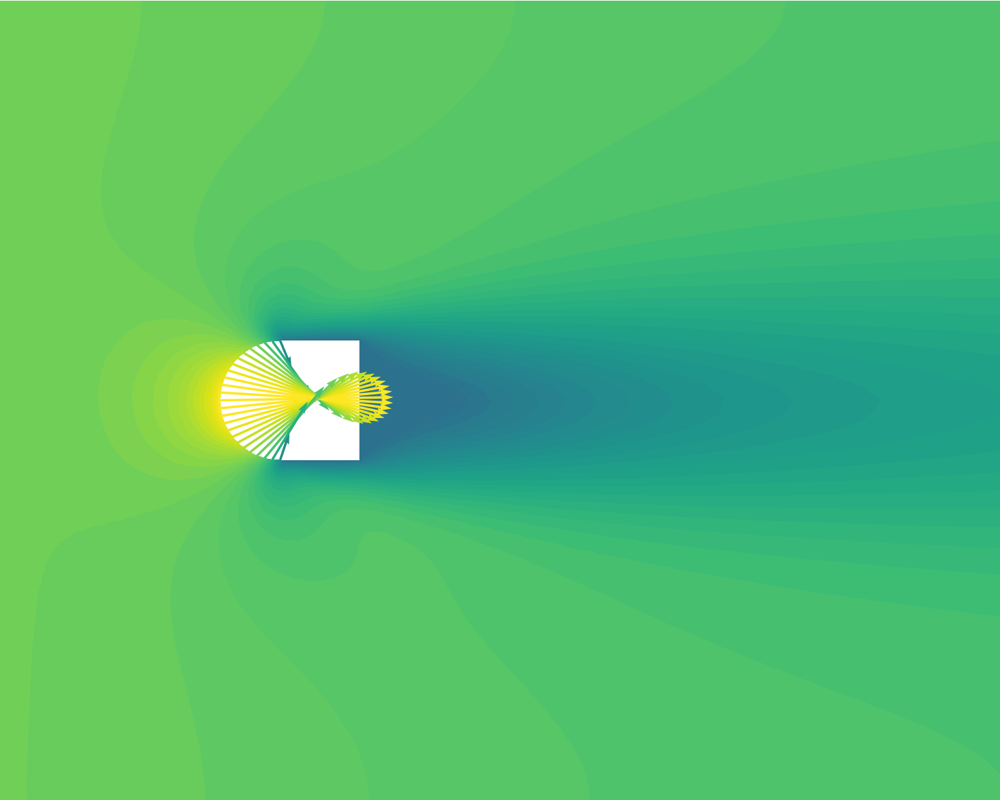
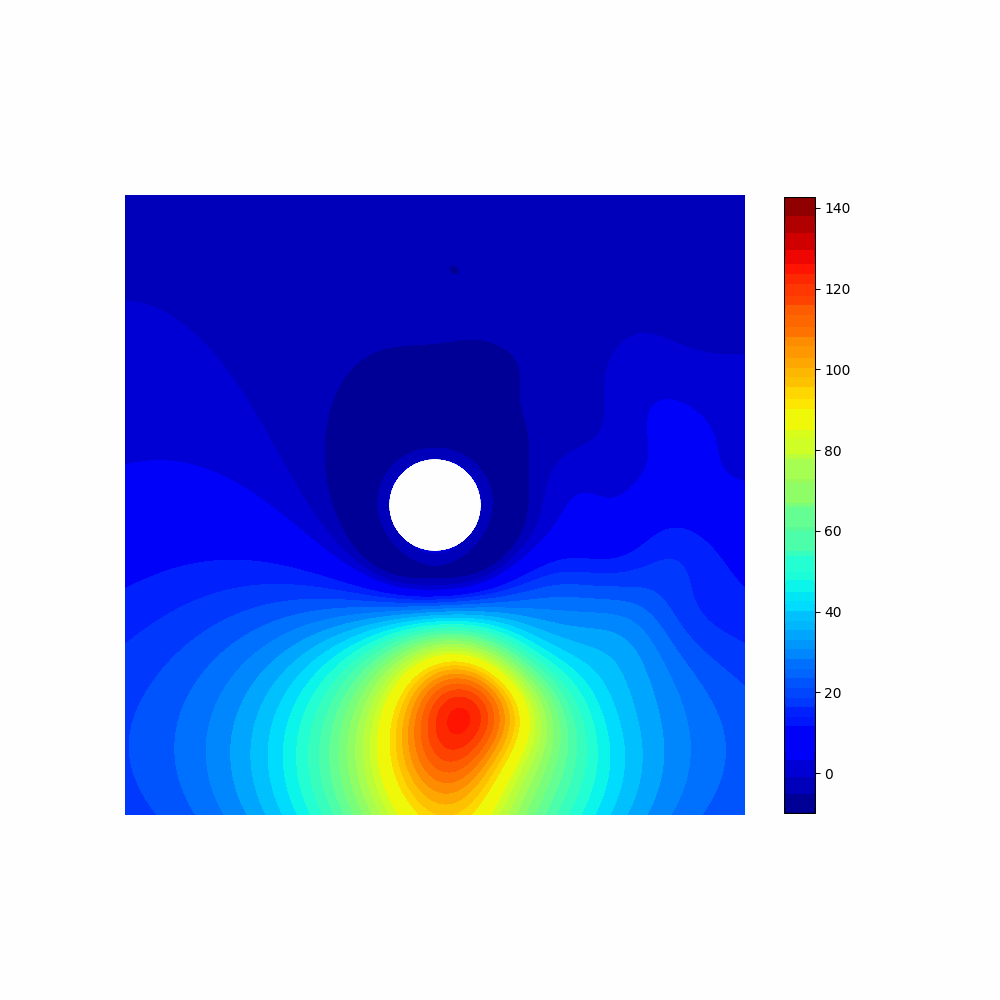
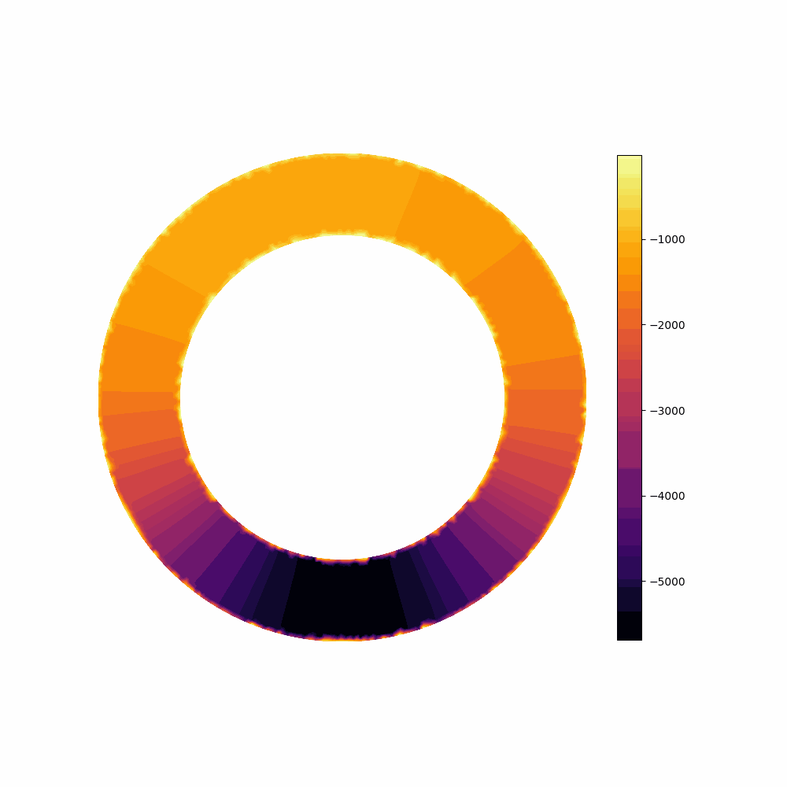

# Real-time optimal control of parametrized systems by Deep learning-based reduced order models

This repository contains the official source code implementation of the paper
*Real-time optimal control of parametrized systems by Deep learning-based reduced order models*

`Data` folder contains the scenario parameters and the simulated optimal snapshots for the three test cases

`Mesh` folder contains the mesh files generated for the flow control test cases

`NN` folder contains the autoencoders and the parameter-to-solution maps built and trained in the three test cases

To run the test cases, the package [dlroms](https://github.com/MatteoTomasetto/dlroms) written and maintained by [Nicola Rares Franco](https://github.com/NicolaRFranco) is required to handle meshes, finite element spaces, neural networks and proper orthogonal decomposition

## Steady flow control
`SteadyFlowControl.ipynb` presents the steady flow control test case where the energy dissipation of a fluid in a channel has to be minimized considering different inflow datum. The control action is the velocity on the boundary of an obstacle in the channel. The state dynamics is described by steady Navier-Stokes equations.

  
    
  
   
  Optimal pair for different inflow angles - inflow intensity = 50.0 m/s, 100.0 m/s

## Unsteady flow control
`UnsteadyFlowControl.ipynb` presents the unsteady flow control test case where the energy dissipation of a fluid in a channel has to be minimized considering different inflow datum. The control action is the velocity on the boundary of an obstacle in the channel. The state dynamics is described by unsteady Navier-Stokes equations.

 
  
  
   
  Optimal pair for different time instants - inflow angle = 0.5 rad, 1.0 rad

## Active thermal cooling
`ActiveThermalCooling.ipynb` presents the active thermal cooling test case where the temperature of an object has to be kept constant and equal to a reference value considering different heat source positions. The control action is an external source in an annular region around the object. The state dynamics is described by steady heat equation.

  
  
   
  Optimal pair for different source positions - rs = 0.65

