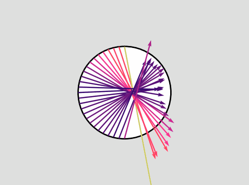

# Real-time optimal control of parametrized systems by DL-ROMs

This repository contains the official source code implementation of the paper *Real-time optimal control of parametrized systems by deep learning-based reduced order models* ([arXiv](
https://doi.org/10.48550/arXiv.2409.05709)).

`Data` folder contains the scenario parameters and the simulated optimal snapshots for the three test cases;

`Mesh` folder contains the mesh files generated for the flow control test cases;

`NN` folder contains the autoencoders and the parameter-to-solution maps built and trained in the three test cases;

To run the test cases, the library [dlroms](https://github.com/MatteoTomasetto/dlroms) is required to handle meshes, finite element spaces, neural networks and proper orthogonal decomposition.

<p align="center" width="100%">
  
  <br />
</p>

## Quickstart

```python
import torch
import numpy as np

# Generate or import the data matrices Y and U collecting optimal state and control snapshots, respectively, along with the corresponding scenario parameters MU

# Initialize OCP object
from dlroms.ocp import OCP
ocp = OCP(ntrain) # ntrain is the number of training data

# Define error metrics
from dlroms.roms import mre, mse, euclidean
mse = mse(euclidean)
mre = mre(euclidean)
```

```python
# POD+AE state reduction
from dlroms.dnns import Dense
ry = ... # Number of state POD modes
hy = ... # Latent state dimension
encoder = Dense(ry, ...) + Dense(..., ...) + Dense(..., hy) # Define encoder architecture
decoder = Dense(hy, ...) + Dense(..., ...) + Dense(..., ry, activation = None) # Define decoder architecture
zy, Y_rec, Psi_y, sigma_y = ocp.PODAE(Y, k = ry, encoder = encoder, decoder = decoder, epochs = ..., loss = mse, error = mre) # only the first ntrain data used for training. zy are the latent variables, Y_rec the encoded-decoded data, Psi_y and sigma_Y are the POD modes and singular values
```

```python
# POD control reduction
hU = rU = ... # Number of control POD modes
zu, U_rec, Psi_u, sigma_u = ocp.POD(U, k = rU) # only the first ntrain data used for SVD
```

```python
# Latent controller definition
phi = Dense(nparam,  ...) + Dense(..., ...) + Dense(..., hy + hu, activation = None) # Define the latent controller architecture

# Latent controller training
zy_hat, zu_hat = ocp.redmap(phi, MU, [zy, zu], epochs = ..., loss = mse, error = mre) # only the first ntrain data used for training. zy_hat and zu_hat are the state and control approximations at the latent level
```

```python
# Full-order predictions (both training and test data)
from dlroms.roms import projectup # POD decoding
Y_hat = projectup(Psi_y, decoder(zy_hat))
U_hat = projectup(Psi_u, zu_hat)

# Full-order predictions for new test parameters MU_test
zy_test_hat, zu_test_hat = ocp.redmap(phi, MU_test, training = False)
Y_test_hat = projectup(Psi_y, decoder(zy_test_hat))
U_test_hat = projectup(Psi_u, zu_test_hat)
```

## Steady flow control
`SteadyFlowControl.ipynb` presents the steady flow control test case where the energy dissipation of a fluid in a channel has to be minimized considering different inflow datum. The control action is the velocity on the boundary of an obstacle in the channel. The state dynamics is described by steady Navier-Stokes equations.

<p align="center" width="100%">
  
  &emsp; &emsp; &emsp;
  
  <br />
  Optimal pair for different inflow angles - inflow intensity = $50.0$ m/s, $100.0$ m/s
</p>

## Active thermal cooling
`ActiveThermalCooling.ipynb` presents the active thermal cooling test case where the temperature of an object has to be kept constant and equal to a reference value considering different heat source positions. The control action is an external source in an annular region around the object. The state dynamics is described by steady heat equation.

<p align="center" width="100%">
  
  &emsp; &emsp; &emsp;
  
  <br />
  Optimal pair for different source positions - r<sub>s</sub> = $0.65$
</p>


## Unsteady flow control
`UnsteadyFlowControl.ipynb` presents the unsteady flow control test case where the energy dissipation of a fluid in a channel has to be minimized considering different angles of attacks. The control action is the velocity on the boundary of an obstacle in the channel. The state dynamics is described by unsteady Navier-Stokes equations.

<p align="center" width="100%"> 
  
  &emsp; &emsp; &emsp; 
  
  <br />
  Optimal pair prediction - inflow angle = $-0.75$ rad

</p>

<p align="center" width="100%"> 
  
  &emsp; &emsp; &emsp; 
  
  <br />
  Controlled and uncontrolled flow velocity - inflow angle = $-0.75$ rad

</p>

## Cite
If you use this code for your work, please cite

```bibtex
@misc{tomasetto2024ocp-dl-rom,
      title={Real-time optimal control of high-dimensional parametrized systems by deep learning-based reduced order models}, 
      author={Matteo Tomasetto and Andrea Manzoni and Francesco Braghin},
      year={2024},
      eprint={2409.05709},
      archivePrefix={arXiv},
      primaryClass={math.OC},
      url={https://arxiv.org/abs/2409.05709}, 
}
```
